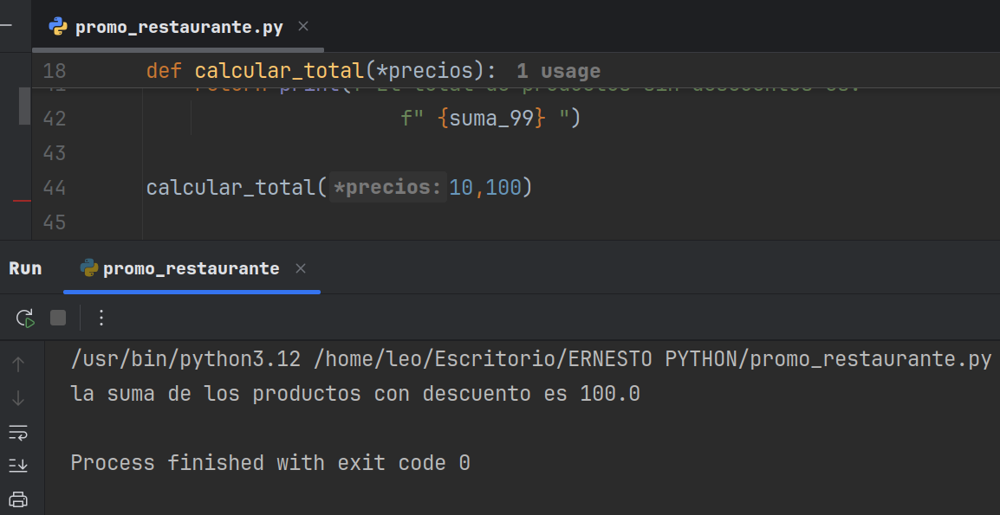

# LISTAS - FUNCIONES - ARGS - FOR - CONDICIONALES
- En esta oportunidad creamos una funcion donde aplicamos descuentos unicamente y exclusivamente
- aquellos productos que se exceden de un precio de 100.$ utilizando; funcion, listas, args, ciclo
- for y condicionales para poder verificar cada monto y como se aplica a cada producto.
- 
- Aqui vemos claramente el resultado cuando ejecutamos el programa
